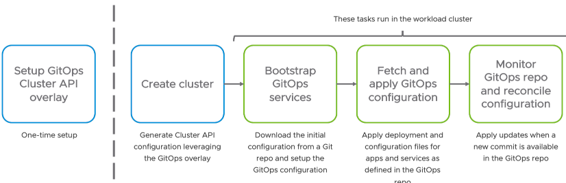

# Using FluxCD with Tanzu to deploy cluster-wide services and apps the GitOps way

This project shows how to use [FluxCD](https://fluxcd.io/)
to deploy cluster-wide services (such as [cert-manager](https://cert-manager.io/)
or [Contour](https://projectcontour.io/)) for [Tanzu clusters](https://tanzu.vmware.com/kubernetes-grid),
along with applications.

Thanks to FluxCD, you can apply a [GitOps approach](https://tanzu.vmware.com/gitops)
to deploy those resources at scale, no matter what cluster, what datacenter you have.
Everything is synchronized with a Git repository, which means you are only a commit away from pushing an update
to every cluster.

## How does it work?



In order to apply a GitOps approach to every cluster, this project relies
on a [Cluster API](https://cluster-api.sigs.k8s.io/) extension.
This extension is responsible for initializing the process, by deploying FluxCD
in workload clusters leveraging a
[ClusterResourceSet](https://cluster-api.sigs.k8s.io/tasks/experimental-features/cluster-resource-set.html) definition.

In this `ClusterResourceSet` object, you would find anything you need to bootstrap FluxCD:

* FluxCD deployment, using open-source packages from [Tanzu Community Edition](https://tanzucommunityedition.io)
* FluxCD initial configuration, including the Git repository with its credentials

This is a one-time setup: just add this Cluster API extension
(implemented as a [ytt](https://carvel.dev/ytt/) overlay)
to your Tanzu management cluster, by copying files in `management-cluster`
to your Tanzu Management cluster installation,
under directory `$HOME/.config/tanzu/tkg/providers/ytt/04_user/gitops`.

Then, rename file `fluxcd-with-tanzu-values.tpl.yaml` to `fluxcd-with-tanzu-values.yaml`,
and set your configuration values accordingly:

```yaml
#@data/values
FLUXCD_CLUSTERS_REPO: https://github.com/alexandreroman/fluxcd-with-tanzu-sample
FLUXCD_CLUSTERS_BRANCH: main
FLUXCD_CLUSTERS_REPO_USERNAME: github
FLUXCD_CLUSTERS_REPO_PASSWORD: INSERT-GIT-PASSWORD-HERE
```

As soon as you create your next workload cluster, this extension will take care of
bootstrapping everything you need to use FluxCD with a GitOps repository.

Check out directory `bootstrap` in this repository to learn about the Kubernetes resources created to deploy and configure FluxCD.

At this point, you need a GitOps repository to store your cluster-wide services and apps.
Go to [github.com/alexandreroman/fluxcd-with-tanzu-sample](https://github.com/alexandreroman/fluxcd-with-tanzu-sample)
to find such a repository layout, suitable to manage many clusters and apps.
Feel free to fork this repo for your needs - don't forget to edit
the Cluster API extension configuration then!

You are free to use any layout for your GitOps repository layout, as long as you have
an entry point for a
[FluxCD Kustomization](https://fluxcd.io/docs/components/kustomize/kustomization/)
 definition under `clusters/MY-CLUSTER-NAME.yaml`.

Here's a FluxCD Kustomization example:

```yaml
#! File: clusters/aro-dev01.yaml
apiVersion: kustomize.toolkit.fluxcd.io/v1beta2
kind: Kustomization
metadata:
  name: cluster-config
  namespace: gitops
spec:
  serviceAccountName: gitops-sa
  interval: 30s
  path: ./env/dev01
  prune: true
  sourceRef:
    kind: GitRepository
    name: clusters
```

A few things to note in this example:

* put your Kustomization definition in namespace `gitops` created as part of the bootstrap process
* use service account `gitops-sa`, a cluster-wide service account you can use to deploy resources
* use the existing `GitRepository`, which is already pointing to the GitOps repository

Then, you are free to organize your GitOps repo in the way that suits you best.
You may want to reuse
[repository layout samples](https://fluxcd.io/docs/guides/repository-structure/)
in the FluxCD documentation.

That's all folks.
Have fun, the GitOps way!

## Contribute

Contributions are always welcome!

Feel free to open issues & send PR.

## License

Copyright &copy; 2022 [VMware, Inc. or its affiliates](https://vmware.com).

This project is licensed under the [Apache Software License version 2.0](https://www.apache.org/licenses/LICENSE-2.0).
